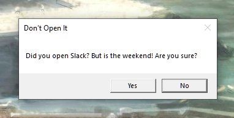

# Don't Open It

**ENGLISH BELOW**

業務時間外についつい業務アプリを開いてしまった時、優しく止めてくれます。

## 使い方

本アプリは通知領域に現れます。業務時間と監視するアプリを設定したり、不要な場合は一時停止（ミュート）できます。

| 終了方法                 | 意味                                                         |
| ------------------------ | ------------------------------------------------------------ |
| アプリに終了するよう要求 | 終了してくれるようアプリにお願いします。紳士的な方法です。   |
| 強制終了                 | 強制的に終了します。アプリによっては問題が起きるかも知れません。上の方法で終了しない時に。 |

## 多言語対応

- 日本語
- 英語

## ライセンス

Copyright (c) 2021 Yuto Fushimi  
Released under the MIT license  
[LICENSE](LICENSE)

# English

Prevent to launch specific app when you are not in working time.

## Usage

This app is in notification area. You could add apps to observe.

| Kill Method     | Detail                                                       |
| --------------- | ------------------------------------------------------------ |
| Request to exit | Ask an app to terminate.                                     |
| Force exit      | Kills an app forcedly. This may cause problems. Use it when the above method does not work. |

## Localization

- Japanese
- English

## License

Copyright (c) 2021 Yuto Fushimi  
Released under the MIT license  
[LICENSE](LICENSE)